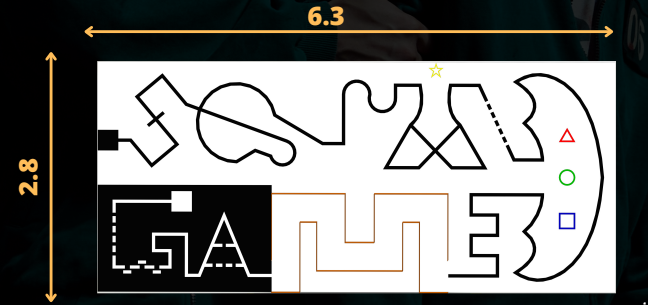
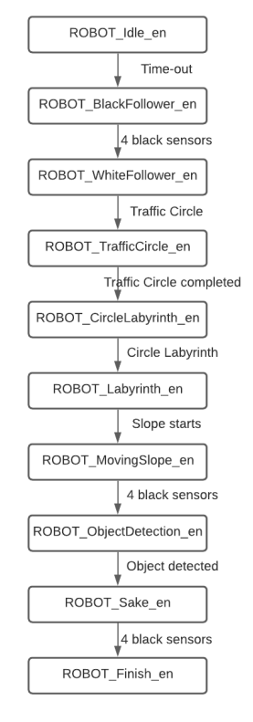

# Line Follower Robot (Enicarth 6.0 competition)

A line follower robot designed for the Enicarth 6.0 competition. This project showcases an Arduino-based line-following robot that utilizes the principles of state machine theory to achieve precise and efficient line tracking capabilities.

## Map


## State machine
A state machine is a behavior model. It consists of a finite number of states and is
therefore also called finite-state machine (FSM). Based on the current state and a
given input the machine performs state transitions and produces outputs.

## The state machine UML design


## Code Implementation
### Macros
This code defines Arduino pins for six line sensors on the robot: Middle Left, Middle Right, Front Right-Middle, Front Left-Middle, Left, and Right
```bash
#define MLav 2
#define MLar 4
#define MRav 5
#define MRar 7
#define enableR 3
#define enableL 11
```
### Variables
```bash
static uint8_t timeout = 0;
static uint8_t c = 0, c1 = 0;
static uint8_t R_Fsensor_state_u8 = 0
static uint8_t R_Rsensor_state_u8 = 0
static uint8_t R_Lsensor_state_u8 = 0
static uint8_t R_MRsensor_state_u8 = 0
static uint8_t R_MLsensor_state_u8 = 0
static uint32_t R_starttime_u32 = 0;
```
### Define and declare the state machine
```bash
typedef enum
{
  R_start_en,
  R_triang_en,
  R_demi_cercle_en,
  R_disr_white_en,
  R_disr_white_en_part2,
  R_transition_en,
  R_square_en,
  R_square_part2_en,
  R_square_part3_en,
  R_square_part4_en,
  R_disr_black_en
} R_STATE;
R_STATE R_CURRENT_STATE =   R_start_en;
```
### Declare functions
```bash
void R_vreadsensors();
void R_vforward();
void R_vbackward();
void R_vright();
void R_vleft();
```
### Execute the state machine:
```bash
switch (R_CURRENT_STATE)
  {

    case R_start_en:
      {
        if (millis() > 1000) {
          timeout = 1;
        }
        R_vreadsensors();
        //     Black_Line_Follower1();
        while ((!R_Rsensor_state_u8)) {
          R_vreadsensors();
          R_vforward();
        }

        while ((!R_Fsensor_state_u8)) {

          R_vreadsensors();
          R_vleft2();
        }

        R_vreadsensors();
        if ((R_Rsensor_state_u8) && (!R_Lsensor_state_u8))
        {
          R_CURRENT_STATE = R_triang_en;

          if (R_Fsensor_state_u8) {
            while (R_Fsensor_state_u8) {
              R_vreadsensors();
              R_vright2();
            }
          }

          while (!R_Fsensor_state_u8) {
            R_vreadsensors();
            R_vright2();
          }
          while (R_Lsensor_state_u8) {
            R_vreadsensors();
            R_vright2();
          }

        }
      } break;


    case R_triang_en:
      {

        Black_Line_Follower();

        R_vreadsensors();
        if ((R_Lsensor_state_u8) && (R_Rsensor_state_u8) && (R_Fsensor_state_u8)) {
          R_CURRENT_STATE =  R_demi_cercle_en;
        }

      } break;

    case R_demi_cercle_en:
      {
        R_vreadsensors();

        if ( R_MLsensor_state_u8 && R_MRsensor_state_u8 ) {
          R_vforward();
        }
        else if ( !R_MLsensor_state_u8 && (R_MRsensor_state_u8) ) {
          R_vright2();
        }
        else if ( R_MLsensor_state_u8 && (!R_MRsensor_state_u8) ) {
          R_vleft2();
        }
        else if (R_Rsensor_state_u8) {

          while (!R_Fsensor_state_u8) {
            R_vreadsensors();
            R_vleft2();
          }

          while ((!R_MLsensor_state_u8) && (!R_MRsensor_state_u8)) {
            R_vreadsensors();
            R_vforward();
          }

          R_CURRENT_STATE =   R_disr_white_en;

        }

      } break;

    case   R_disr_white_en:
      {

        R_vreadsensors();
        if (R_MLsensor_state_u8 && R_MRsensor_state_u8) {
          R_vforward();
        }
        else if ( !(R_MLsensor_state_u8) && (R_MRsensor_state_u8) && !(R_Lsensor_state_u8 )) {

          R_vright2();
          //  R_vright2();
        }
        else if (( R_MLsensor_state_u8 && (!R_MRsensor_state_u8))) {
          R_vleft2();

        }

        else if (R_Lsensor_state_u8 )
        {
          
          R_CURRENT_STATE =   R_disr_white_en_part2;
          while (R_Lsensor_state_u8) {
            R_vreadsensors();
            R_vforward();

          }
        }


      } break;

    case R_disr_white_en_part2: {
        R_vreadsensors();

        if (!R_Lsensor_state_u8) {
          R_vreadsensors();
          if ( R_MLsensor_state_u8 && R_MRsensor_state_u8 ) {
            R_vforward();
          }
          else if ( !R_MLsensor_state_u8 && (R_MRsensor_state_u8) ) {
            R_vright2();
          }
          else if ( R_MLsensor_state_u8 && (!R_MRsensor_state_u8) ) {
            R_vleft2();
          }
        }
        if (R_Lsensor_state_u8)
        {
          R_CURRENT_STATE =   R_disr_black_en;
          while (R_Lsensor_state_u8) {
            R_vreadsensors();
            R_vleft2();

          }
          while (!R_Fsensor_state_u8) {
            R_vreadsensors();
            R_vleft2();

          }
          //    while (1) R_vstop();
          R_vstop(); delay(100);
        }


      } break;


    case  R_disr_black_en:
      {
        R_vreadsensors();
        if ( R_MLsensor_state_u8 && R_MRsensor_state_u8 ) {
          R_vforward();
        }
        else if ( !R_MLsensor_state_u8 && (R_MRsensor_state_u8) ) {
          R_vright2();
        }
        else if ( R_MLsensor_state_u8 && (!R_MRsensor_state_u8) ) {
          R_vleft2();
        }
        else if ( !R_MLsensor_state_u8 && !R_MRsensor_state_u8 ) {

          R_CURRENT_STATE = R_square_en;
          //    while (1) R_vstop();
          R_vstop(); delay(100);
        }
      } break;
    case  R_transition_en:
      {
        R_vreadsensors();
        if ( !R_MLsensor_state_u8 && !R_MRsensor_state_u8 ) {
          R_vforward();
        }
        else if ( !R_MLsensor_state_u8 && (R_MRsensor_state_u8) ) {
          //   R_vleft2();
          R_vright2();
        }
        else if ( R_MLsensor_state_u8 && (!R_MRsensor_state_u8) ) {
          //   R_vright2();
          R_vleft2();
        }
        else if ( R_MLsensor_state_u8 && R_MRsensor_state_u8 && R_Rsensor_state_u8 ) {
          //      while (1) R_vstop();
          R_vstop(); delay(1000);
          R_CURRENT_STATE = R_square_en;
        }

      } break;
    case  R_square_en:
      {

        R_vforward(); delay(650);
        while ( R_Fsensor_state_u8  ) {
          R_vreadsensors();
          R_vright2();
        }
        R_vstop(); delay(300);
        while ( R_Lsensor_state_u8  ||   R_Rsensor_state_u8 ) {
          R_vreadsensors();
          R_vforward();
        }
        R_vbackward(); delay(100);
        R_vstop(); delay(300);
        while ( R_Fsensor_state_u8  ) {
          R_vreadsensors();
          R_vleft2();
        }
        R_vstop(); delay(300);
        R_CURRENT_STATE = R_square_part2_en;
        //  while (1) R_vstop();
      } break;
    case  R_square_part2_en:
      {
        R_vreadsensors();
        White_Line_Follower();
        R_vreadsensors();
        if (R_MLsensor_state_u8 && R_MLsensor_state_u8 && R_MRsensor_state_u8 && R_Rsensor_state_u8) {
          R_vstop(); delay(200);
                    while (1) R_vstop();
          R_CURRENT_STATE = R_square_part3_en;
        }
      } break;
    case  R_square_part3_en:
      {

        R_vreadsensors();
        R_vforward();
        if (!R_Lsensor_state_u8) {
          while (!R_Lsensor_state_u8) {
            R_vforward();
          } 
        
        //  R_CURRENT_STATE = R_square_part4_en;
                   while (1) R_vstop();
        }
          else if (!R_MLsensor_state_u8 && (R_MRsensor_state_u8)) {
    R_vleft2();
  }
  else if (R_MLsensor_state_u8 && (!R_MRsensor_state_u8)) {
    R_vright2();
  }

      } break;
    case  R_square_part4_en:
      {
                R_vreadsensors();
        White_Line_Follower();
      } break;

      default: {
          //while (1) R_vstop();
        }
      }
  
```

